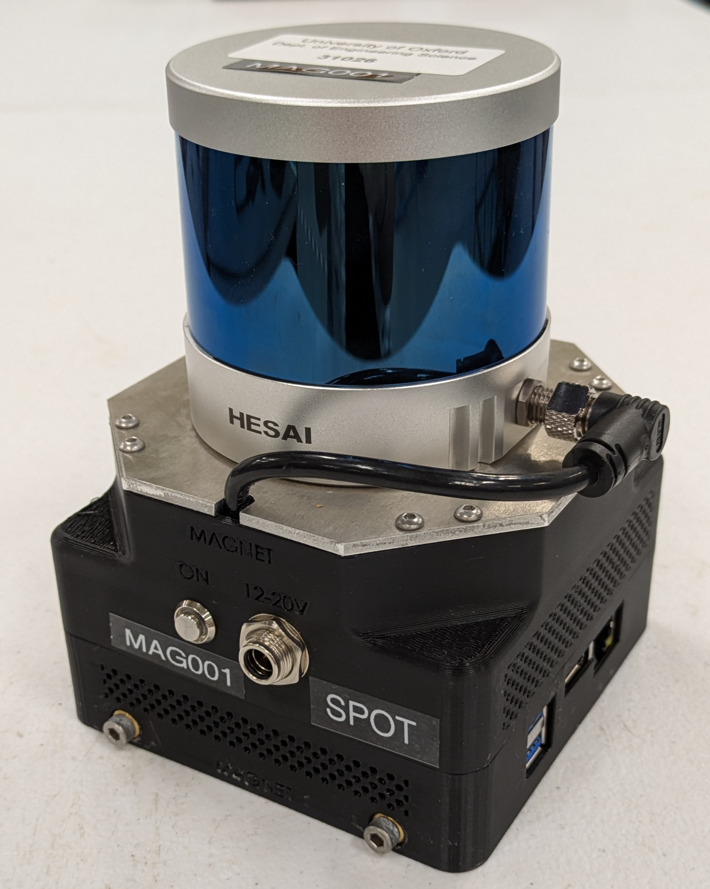
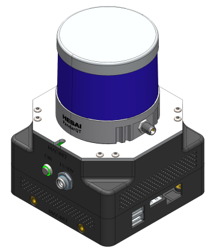
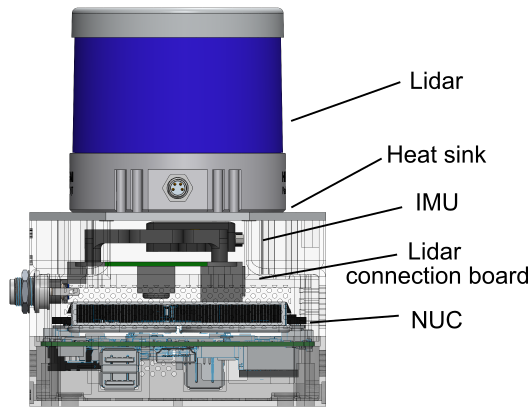
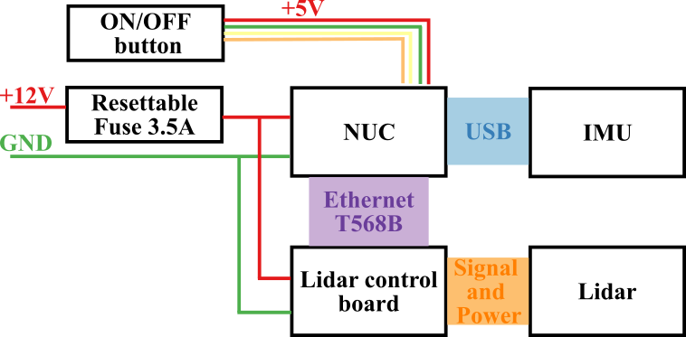
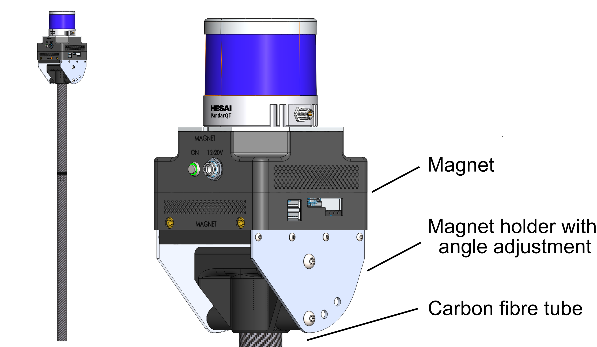
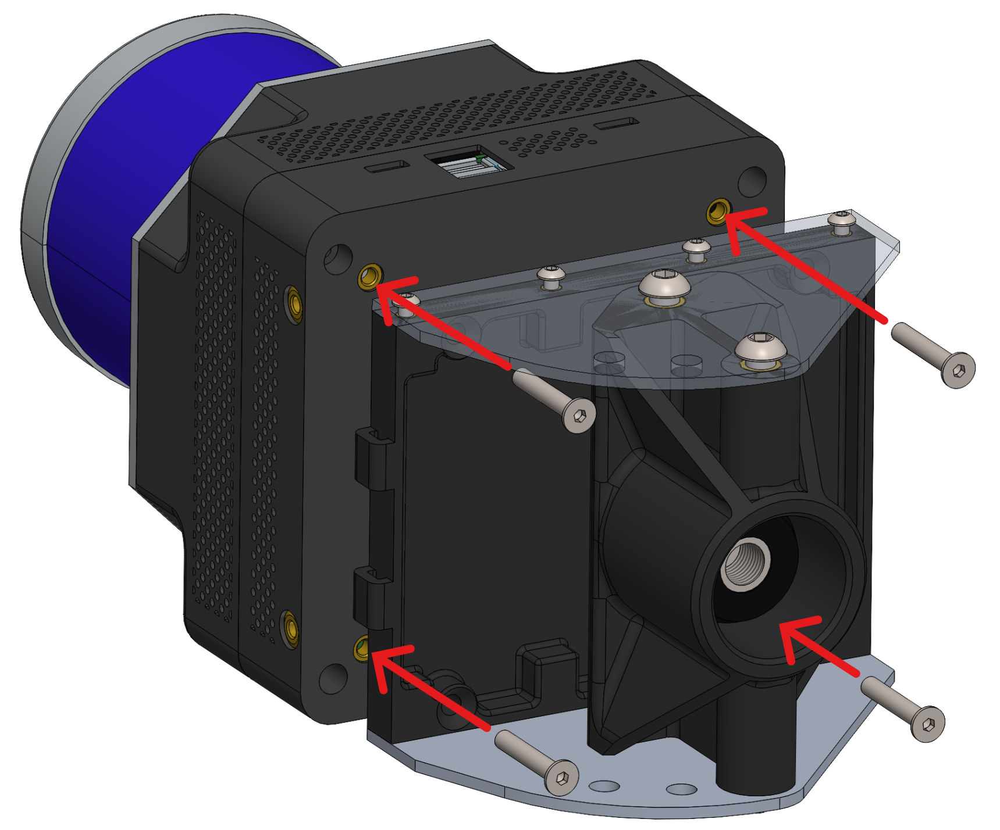
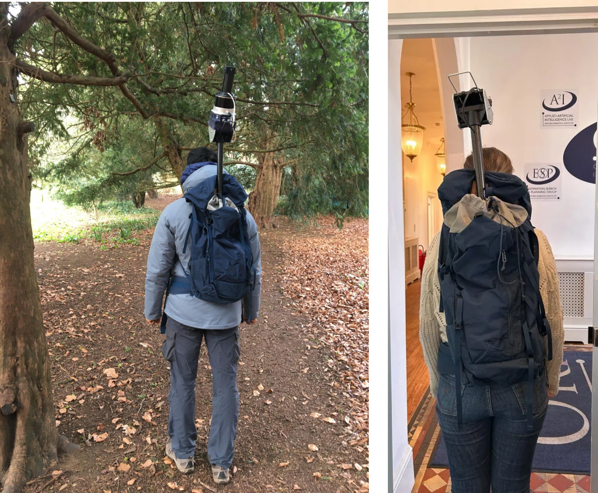

# magnet_design
Design instructions for the ORI Magnet Lidar Mapping device

   

Magnet is a compact, rugged LiDAR mapping unit developed at the Oxford Robotics Institute (ORI) for research into 3D mapping and mobile robot autonomy. It integrates a Hesai QT64 LiDAR, a Microstrain GX5-15 IMU, and an Intel NUC computer, all housed within a modular enclosure. The device is capable of running real-time 3D mapping algorithms and can be mounted on a robot or used as a handheld device.

This repository provides the 3D CAD files and basic manufacturing guidance required to reproduce the hardware. Note that Magnet requires additional software to perform 3D mapping or enable autonomy in robotic applications.

## Core Components

| Component         | Model                                      |
|------------------|--------------------------------------------|
| Onboard Computer | [Intel NUC Topaz 3 i7](https://simplynuc.co.uk/product/nuc13tzi7/) |
| IMU              | [Microstrain 3DM-GX5-AR](https://www.hbkworld.com/en/products/transducers/inertial-sensors/vertical-reference-units--vru-/3dm-gx5-ar#!ref_microstrain.com)|
| LiDAR            | [HESAI QT64](https://www.datrontechnology.co.uk/qt64/)|

## Mechanical Design & CAD
This repository contains the STEP files for the CAD models and the corresponding STL files for 3D printing.

- **Overall size and weight:** 110 × 110 × 148 mm (including QT64), 1106 g
- **Design files directory:** [`CAD/Magnet`](./CAD/Magnet)
- **URDF link:** [`magnet_description`](https://github.com/ori-drs/magnet_description)

## Assembly Notes

  

- **Case:** 3D printed in PLA using a Bambu Lab printer.  
- **Heatsink:** Cut from a 3 mm aluminium sheet.  
  *Note: A metal sheet is highly recommended to ensure effective heat dissipation during prolonged LiDAR operation*

- **Tappex inserts (for 3D printed parts):**
  - **Top case:** 16 × M3 × 5.2 mm (unflanged)
  - **Bottom case:** 8 × M4 × 3.0 × 7.9 mm (flanged)  
    *These inserts are used to mount Magnet onto robots or rigs.*
  - **IMU mount:** 2 × M3 × 5.2 mm (unflanged)
- **Power inlet:** 2.5mm DC Socket (e.g. L712AS)
- **Wiring logic:**
  

     
  

   
  *Note: This is not a schematic diagram. For detailed electronic connections, please refer to the datasheets of the respective components.*

## Power supply
- **Input voltage:** 12–19 V  
- **Maximum power:** 90 W    
  *Note: These values are specific to our physical prototype and may vary depending on the components used in your build.*

<<<<<<< HEAD
## Application Example - Wearable Mobile Device
Magnet can be configured as a portable mapping unit for field data collection. In this setup, the device is mounted on a mounting pole and powered by an external battery pack. This design allows handheld or backpack-based operation for large-scale 3D environment mapping. 

  

The current wearable configuration developed at ORI consists of:

- **Mounting pole:** 80 cm carbon fibre tube (Ø 30 mm) and a 3D printed Magnet holder with an angle adjustment mechanism
- **Total height:** 85 cm (pole only) / 100 cm (including Magnet)  
- **System weight:** ≈ 4 kg (including backpack frame, pole, Magnet, and battery)  
- **Energy source:** PAG 90 Slim Battery - 90Wh 14.8V nominal 
- **Design files directory:** [`CAD/Mounting_Pole`](./CAD/Mounting_Pole)

The Magnet can be attached to the mounting pole using four M4 screws to secure the unit's Tappex mounting points (on the bottom case) to the dedicated holder interface.

   

  
This assembled Magnet-pole can then be mounted onto a backpack with an aluminium support frame for extended deployment or mapping missions.

   

  

## Application Example - Robot Deployment
Magnet can be integrated into a robotic platform for autonomous mapping and navigation. The device can be mounted securely using the Tappex mounting points (located on the side and bottom of the Magnet case) to a dedicated holder interface (not included in this repository and subjected to individual platform) on the robot. At ORI, Magnet has been successfully deployed on the Clearpath Jackal robot, where it is powered from the robot’s onboard supply via a bulk regulator. 

  

  
*Note: It is important to ensure that the electrical specifications of the target platform are compatible with Magnet’s requirements, or else an appropriate regulator or power management module must be added.*

=======
## Application Example

  

  
>>>>>>> c7e4b985fbdf5089ad046af39faa3cd652069c09
